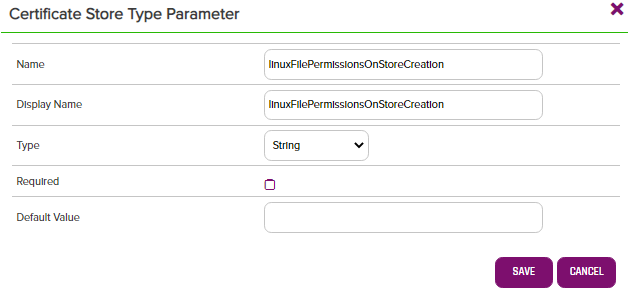
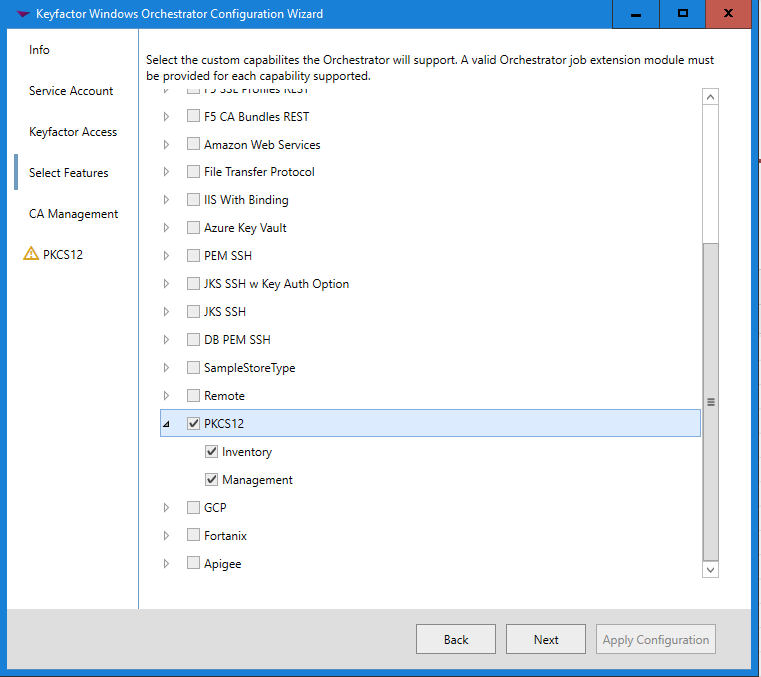

# Remote PKCS12
## windows-orchestrator

The PKCS12 Windows AnyAgent allows a user to inventory and manage (both add and remove) PKCS12 certificate stores on both Windows and Linux servers.

<!-- add integration specific information below -->

## Use Cases

The PKCS12 Windows AnyAgent implements the following capabilities:
1. Create - Create an empty PKCS12 certificate store.
2. Inventory - Return all certificates for a define certificate store.
3. Management (Add) - Add a certificate to a defined certificate store.
4. Management (Remove) - Remove a certificate from a defined certificate store.

The PKCS12 Windows AnyAgent supports the following types of certificate stores:
1. Trust stores (multiple public certificates with no private keys)
2. Stores with one or more aliases (friendly names)
3. Stores with certificate chains included in the entry

This AnyAgent supports Java Keystores of type PKCS12 along with any other certificate stores creating using the PKCS#12 standard.  It does NOT at this time support Java Keystores of type JKS or any other types besides PKCS12.  It differs from the Java Keystore AnyAgent - [https://github.com/Keyfactor/jks-remote-windowsorchestrator] in that it uses the BouncyCastle .Net code library to manage the certificate store rather than remoting keytool commands.  Also, the Java Keystore AnyAgent DOES support Java keystores of type JKS where the PKCS12 one does not.

## Versioning

The version number of a the PKCS12 Windows AnyAgent can be verified by right clicking on the PKCS12.dll file in the Plugins installation folder, selecting Properties, and then clicking on the Details tab.

## Keyfactor Version Supported

The PKCS12 Windows AnyAgent has been tested against Keyfactor Windows Orchestrator version 8.5 but should work against earlier or later versions of the Keyfactor Windows Orchestrator.  This AnyAgent is NOT compatible with the Keyfactor Universal Orchestrator.  A version compliant with that will be completed at a future date.

## Security Considerations

**For Linux orchestrated servers:**
1. The PKCS12 AnyAgent makes use of SFTP to upload and download certificate and certificate store files as well as the following common Linux shell commands:
    * cp
    * rm
    * touch
2. If the credentials you will be connecting with will need elevated access to run these commands, you must set the id up as a sudoer with no password necessary and set the config.json "UseSudo" value to "Y" (See Section 4 regarding the config.json file).
3. As mentioned in #1, the PKCS12 AnyAgent makes use of SFTP to transfer files to and from the orchestrated server.  SFTP will not mske use of sudo, so all folders containing certificate stores will need to allow SFTP file transfer.  If this is not possible, set the values in the config.json apprpriately to use an alternative upload/download folder that does have SFTP file transfer (See Section 4 regarding the config.json file).

**For Windows orchestrated servers:**
1. Make sure that WinRM is set up on the orchestrated server and that the WinRM port is part of the certificate store path when setting up your certificate stores (See Section 3a below). 
2. The PKCS12 AnyAgent makes use of the following Powershell cmdlets:
    * Get-Content
    * Set-Content
    * Out-File
    * Test-Path

## PKCS12 AnyAgent Configuration

**1. Create the New Certificate Store Type for the New PKCS12 AnyAgent**

In Keyfactor Command create a new Certificate Store Type similar to the one below:

- **Name** – Required. The display name of the new Certificate Store Type
- **Short Name** – Required. **MUST** be &quot;PKCS12&quot;
- **Needs Server, Blueprint Allowed, Requires Store Password, Supports Entry Password** – All checked/unchecked as shown
- **Supports Custom Alias** – Required. Each certificate MUST have an alias associated with it for the store.
- **Use PowerShell** – Unchecked
- **Store PathType** – Freeform (user will enter the the location of the store)
- **Private Keys** – Optional (a certificate in a PKCS12 certificate store may or may not contain a private key depending if it is a trust store or not)
- **PFX Password Style** – Default
- **Job Types** – Create, Inventory, Add, and Remove are the 4 job types implemented by this AnyAgent
- **Management Job Custom Fields** - Keep blank.
- **Linux File Permissions on Store Creation** - Optional.  Overrides the optional config.json DefaultLinuxPermissionsOnStoreCreation setting (see section 4 below) for a specific certificate store.  This value will set the file permissions (Linux only) of a new certificate store created via a Management-Create job.  If this parameter is not added or added but not set, the permissions used will be derived from the DefaultLinuxPermissionsOnStoreCreation setting. 

**2. Register the PKCS12 AnyAgent with Keyfactor**

Open the Keyfactor Windows Agent Configuration Wizard and perform the tasks as illustrated below:

- Click **\<Next\>**

- If you have configured the agent service previously, you should be able to skip to just click **\<Next\>.** Otherwise, enter the service account Username and Password you wish to run the Keyfactor Windows Agent Service under, click **\<Update Windows Service Account\>** and click **\<Next\>.**

- If you have configured the agent service previously, you should be able to skip to just re-enter the password to the service account the agent service will run under, click **\<Validate Keyfactor Connection\>** and then **\<Next\>.**

- Select the agent you are adding capabilities for (in this case, PKCS12, and also select the specific capabilities (Inventory and Management in this example). Click **\<Next\>**.

- For agent configuration purposes, this screen can be skipped by clicking **\<Next\>**.

- For each AnyAgent implementation, check **Load assemblies containing extension modules from other location** , browse to the location of the compiled AnyAgent dll, and click **\<Validate Capabilities\>**. Once all AnyAgents have been validated, click **\<Apply Configuration\>**.

- If the Keyfactor Agent Configuration Wizard configured everything correctly, you should see the dialog above.

**3. Create a PKCS12 Certificate Store within Keyfactor Command**

Navigate to Certificate Locations =\> Certificate Stores within Keyfactor Command to add a PKCS12 certificate store. Below are the values that should be entered.

- **Category** – Required. The PKCS12 type name must be selected.
- **Container** – Optional. Select a container if utilized.
- **Client Machine &amp; Credentials** – Required. The server name or IP Address and login credentials for the server where the Certificate Store is located.  The credentials for server login can be any of:
  
  - UserId/Password
  
  - UserId/SSH private key (entered in the password field)
  
  - PAM provider information to pass the UserId/Password or UserId/SSH private key credentials
  
When setting up a Windows server, the format of the machine name must be – http://ServerName:5985, where &quot;5985&quot; is the WinRM port number. 5985 is the standard, but if your organization uses a different port, use that.  The Keyfactor Command service account will be used if the credentials are left blank.  **However, if you choose to not enter credentials and use the Keyfactor Command service account, it is required that the *Change Credentials* link still be clicked on and the resulting dialog closed by clicking OK.**
  
- **Store Path** – Required. The FULL PATH and file name of the pkcs12 certificate store being managed. File paths on Linux servers will always begin with a &quot;/&quot;. Windows servers will always begin with the drive letter, colon, and backslash, such as &quot;c:\\&quot;.  Valid characters for Linux store paths include any alphanumeric character, space, forward slash, hyphen, underscore, and period. For Windows servers, the aforementioned characters as well as a colon and backslash.
- **Orchestrator** – Select the orchestrator you wish to use to manage this store
- **Store Password** – Required. Set the store password or set no password after clicking the supplied button
- **Linux File Permissions on Store Creation** - Optional (Linux only). Set the Linux file permissions you wish to be set when creating a new physical certificate store via checking Create Certificate Store above.  This value must be 3 digits all betwwen 0-7.
- **Inventory Schedule** – Set a schedule for running Inventory jobs or none, if you choose not to schedule Inventory at this time.

**4. Update Settings in config.json**

As a configuration step, you must modify the config.json file, found in the plugins folder of your Keyfactor Agent PKCS12 installation (usually C:\Program Files\Certified Security Solutions\Certificate Management System Agent\plugins\PKCS12). This file contains the following JSON:

{
    
&quot;UseSudo&quot;: &quot;N&quot;,

&quot;UseSeparateUploadFilePath&quot;: &quot;N&quot;,

&quot;SeparateUploadFilePath&quot;: &quot;/path/to/upload/folder/&quot;,

&quot;DefaultLinuxPermissionsOnStoreCreation&quot;: &quot;600&@quot; 

Modify the three values as appropriate (all must be present regardless of Linux or Windows server orchestration):

**UseSudo** (Linux only) - to determine whether to prefix certain Linux command with "sudo". This can be very helpful in ensuring that the user id running commands ssh uses "least permissions necessary" to process each task. Setting this value to "Y" will prefix all Linux commands with "sudo" with the expectation that the command being executed on the orchestrated Linux server will look in the sudoers file to determine whether the logged in ID has elevated permissions for that specific command. For orchestrated Windows servers, this setting has no effect. Setting this value to "N" will result in "sudo" not being added to Linux commands.

**UseSeparateUploadFilePath** (Linux only) – When adding a certificate to a PKCS12 certificate store, the AnyAgent must upload the certificate being deployed to the server where the certificate store resides. Setting this value to &quot;Y&quot; looks to the next setting, SeparateUploadFilePath, to determine where this file should be uploaded. Set this value to &quot;N&quot; to use the same path where the certificate store being managed resides. The certificate file uploaded to either location will be removed at the end of the process.

**SeparateUploadFilePath** (Linux only) – Only used when UseSeparateUploadFilePath is set to &quot;Y&quot;. Set this to the path you wish to use as the location to upload and later remove certificates to be added to the PKCS12 certificate store being maintained.

**DefaultLinuxPermissionsOnStoreCreation** (Linux only) - Optional.  Value must be 3 digits all between 0-7.  The Linux file permissions that will be set on a new certificate store created via a Management Create job.  This value will be used for all certificate stores managed by this orchestrator instance unless overridden by the optional "Linux File Permissions on Store Creation" custom parameter setting on a specific certificate store.  If "Linux File Permissions on Store Creation" and DefaultLinuxPermissionsOnStoreCreation are not set, a default permission of 600 will be used.
